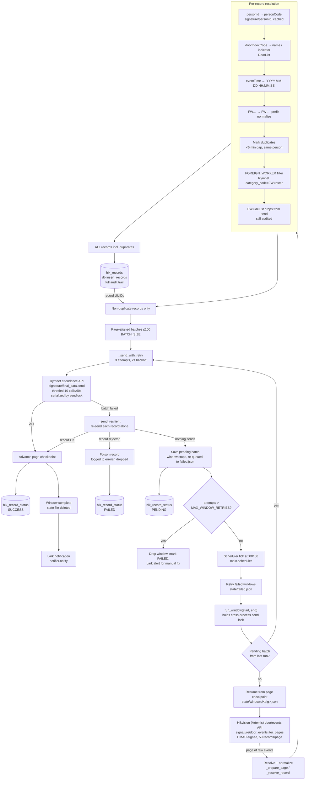
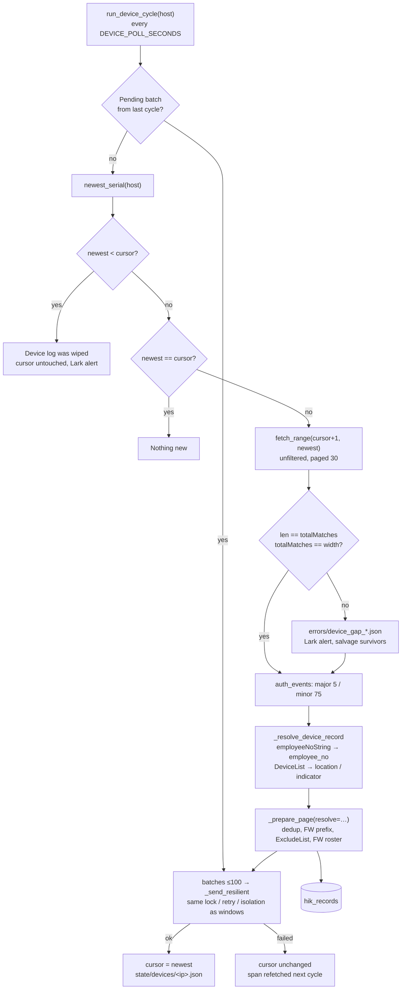

# HIK → Rymnet Attendance Sync

Continuously pulls door-access events from Hikvision, resolves each person's
employee code, records everything to Postgres, and pushes attendance records to
the Rymnet attendance API. Runs as a continuous scheduler with checkpointing,
automatic retries, per-record poison isolation, cross-process send locking,
Rymnet rate limiting, and Lark (Feishu) notifications.

Events arrive over **two independent paths**:

| Path | Source | Indexed by | Doors |
|------|--------|-----------|-------|
| **Artemis** | central server's `door/events` API | 30-minute time windows | every `type=='Door'` in `DoorList` |
| **Device** | the FR terminals themselves, over ISAPI | each device's own `serialNo` counter | every entry in `DeviceList` |

The device path exists because the Artemis path cannot detect its own data loss:
if a device uploads late, the window that would have carried the event has
already closed, and a missing event is indistinguishable from a quiet period.
Reading the terminal directly removes the upload hop, and its gap-free event
counter makes missing data arithmetic rather than guesswork. See
[Device path](#device-path-direct-from-the-fr-terminals).

---

## Table of contents

- [How it works](#how-it-works)
- [Data flow](#data-flow)
- [Device path](#device-path-direct-from-the-fr-terminals)
- [Database](#database)
- [Reliability model](#reliability-model)
- [Nightly catch-up](#nightly-catch-up)
- [Commands](#commands)
- [Common operational flows](#common-operational-flows)
- [Configuration (`.env`)](#configuration-env)
- [Project layout](#project-layout)
- [Module reference](#module-reference)
- [Running under systemd](#running-under-systemd)
- [Tests](#tests)

---

## How it works

Time is processed in **30-minute windows** (48 per day). At each half-hour
boundary the scheduler fetches the window that just *completed* and ships it:

```
08:30 tick → fetch events for 08:00:00 → 08:30:00 → record to DB → send to Rymnet
09:00 tick → fetch events for 08:30:00 → 09:00:00 → record to DB → send to Rymnet
...
```

Within a window, events are fetched page-by-page (50/page) from Hikvision,
every record is inserted into `hik_records` (full audit trail, duplicates
included), non-duplicates are grouped into **page-aligned batches** of up to 100
records and POSTed to Rymnet. Each successfully sent batch advances a per-window
page checkpoint, so a crash or outage never re-sends already-delivered records.

## Data flow



## Device path (direct from the FR terminals)

Two doors are served this way — `DeviceList.py` maps device IP → door metadata,
and those doors are **commented out of `DoorList`** so the Artemis path no longer
fetches them:

```python
'10.1.72.122': {"doorIndexCode": 4729, "type": "Door", "doorName": "WHCJ IN - FR",  "indicator": "IN"},
'10.1.72.119': {"doorIndexCode": 4741, "type": "Door", "doorName": "WHCJ OUT - FR", "indicator": "OUT"},
```

Both mappings were confirmed by parity: the device's own log and the Artemis API
returned identical `(employee_no, timestamp)` sets — 1457 events over 3 days,
zero one-sided.

### Why serials instead of time windows

Every device event carries a monotonic counter (`serialNo`) shared by all event
types, with no skipped values. A fetch therefore asks for a span of numbered
slots and can *prove* completeness:

```
width = end - begin + 1          slots asked for
totalMatches == width            the device's log has no holes
len(events)  == totalMatches     paging retrieved everything offered
```

Both checks are enforced in `device_events.fetch_range`. Consequences:

- **Nothing is silently missed.** A hole is a number, not an inference.
- **Downtime self-heals.** A poller offline for hours just asks for a wider span.
- **Any span is replayable**, exactly, for as long as the device retains it
  (observed: back to 2025-12-17 on `10.1.72.122`).

The query must be **unfiltered** (`major:0, minor:0`) because the completeness
check needs the dense counter; `major 5 / minor 75` (successful authentication —
the only event carrying `employeeNoString`) is filtered in-process afterwards.

### Cycle



No Artemis person lookup: the device's `employeeNoString` **is** the Artemis
`personCode` (verified against the personId API), so the whole
`personId → personCode` round trip disappears.

Everything after resolution is the existing machinery — dedup, `ExcludeList`,
`FOREIGN_WORKER` roster, `hik_records`, batching, send lock, retries, poison
isolation, `hik_record_status`.

### State

`state/devices/<ip>.json`:

```json
{ "device": "10.1.72.119", "cursor": 134609, "updated": "2026-08-12 16:44:02",
  "last_sent": { "RC13501|WHCJ - FR": "2026-08-12 15:54:07" } }
```

- `cursor` — highest serial fully processed. Advances **only** after a successful
  send, so a failed cycle refetches the same span.
- `last_sent` — dedup memory carried across cycles. Device polls are short and
  frequent, so without persisting it two events seconds apart either side of a
  cycle boundary would both pass the `MIN_GAP_MINUTES` check. Aged against the
  newest event seen, not the wall clock.

### Behaviour on trouble

| Condition | Detected by | Action |
|-----------|-------------|--------|
| Device log has holes | `totalMatches != width` | log `errors/device_gap_*.json`, Lark alert, **send survivors and advance** (log holes never heal) |
| Paging lost rows | `len(events) != totalMatches` | `DeviceFetchError`, cycle aborts, cursor untouched, retried next poll |
| Device log wiped (counter restarts at 1) | `newest < cursor` | Lark alert, cursor **untouched** — needs a manual `state/devices/` fix before that device syncs again |
| Device unreachable / 401 storm | `DeviceFetchError` after 5 attempts | logged, other devices continue, retried next poll |
| Rymnet rejects a batch | existing `_send_resilient` | pending saved against the device signature, retried first next cycle |
| First ever run | `cursor is None` | cursor set to newest, **no backfill**, Lark note. To backfill, edit `state/devices/<ip>.json` |

### Device quirks that shaped the code

- **`maxResults` caps at 30.** Longer spans need paging.
- **One `searchID` per result set.** A fresh ID per page makes the device answer
  from a different cached search — observed silently truncating 1148 events to
  41, with a matching (wrong) `totalMatches`.
- **One `requests.Session` per device.** A fresh `HTTPDigestAuth` per request
  re-challenges and the device starts returning `401` after ~8 rapid calls.
- **Occasional empty HTTP 200 bodies.** Retried with backoff.
- **`beginSerialNo` requires `endSerialNo`** — alone it's `400 badJsonContent`.
  Serial-range queries need no time bounds at all.
- **`alertStream` is not used as a data source.** It only pushes live events, has
  no history to re-ask, and replays a device's offline backlog with whatever
  clock the device had at the time (a capture showed serials `1…29` stamped
  `2026-01-01`). `devices.py` is the raw listener kept for reference.

---

## Database

Postgres, two tables. The DB layer is **best-effort**: if `PG_*` env vars are
unset, every DB call is a silent no-op; DB errors are logged, never raised — the
sync keeps working without the DB.

### `hik_records` — full audit trail

Every fetched record, **duplicates included**. One row per record seen, ever.
Re-running a window inserts *fresh* rows (never upserts), so reruns always add
new entries.

| column | type | notes |
|--------|------|-------|
| `id` | `uuid` | PK, DB-generated (`gen_random_uuid()`) |
| `employee_no` | varchar | |
| `logtime` | timestamp | `YYYY-MM-DD HH:MM:SS` |
| `location`, `indicator`, `remark` | varchar | |
| `date_created`, `created_by` | timestamp / varchar | `created_by='system'` on insert |
| `date_modified`, `modified_by`, `date_deleted`, `deleted_by` | | audit fields |

### `hik_record_status` — send status

One row per record that was actually **ready to send** (non-duplicates only —
duplicates get no status row). Tracks the send lifecycle.

| column | type | notes |
|--------|------|-------|
| `id` | `uuid` | PK, DB-generated |
| `hik_record_id` | `uuid` | FK → `hik_records.id` `ON DELETE CASCADE` |
| `status` | varchar | `SUCCESS` \| `PENDING` \| `FAILED` |
| `date_created`, `created_by` | | `created_by='system'` on first insert |
| `date_modified`, `modified_by` | | `modified_by=<OS user>` on manual reruns |

**Status lifecycle:** first write inserts (`created_by='system'`); later
transitions update in place (`modified_by=ACTOR`).

- `SUCCESS` — delivered to Rymnet.
- `PENDING` — queued / awaiting retry (whole batch failed, saved for later).
- `FAILED` — isolated as a poison record and dropped, or gave up after max retries.

`db.ACTOR` is `'system'` for the scheduler; manual reruns (`main.py --start/--end`,
`--recover-windows`, `debug_pending.py`) set it to the OS username so
`modified_by` reflects the human operator.

### Schema / migration

`schema.sql` holds the incremental migration for the `status` column + a
supporting index (idempotent, `IF NOT EXISTS`). Apply with:

```bash
psql "$PG_CONN" -f schema.sql
```

---

## Reliability model

Layered, each independent:

| Layer | Mechanism | On failure |
|-------|-----------|------------|
| **Batch send** | `SEND_RETRIES` (3) inline attempts, `SEND_RETRY_DELAY` (2s) backoff | fall through to per-record isolation |
| **Per-record isolation** | `_send_resilient` re-sends each record of a failed batch alone | good records delivered; **poison records** logged to `errors/`, marked `FAILED`, dropped; window continues |
| **Total batch failure** | if *no* record sends alone (e.g. Rymnet outage) | batch saved as `pending`, records marked `PENDING`, window stops (returns `(False,0)`) |
| **Window** | per-window page checkpoint + pending batch in `state/windows/<hash>.json` | scheduler re-queues to `state/failed.json`, retried one/tick up to `MAX_WINDOW_RETRIES` (10) |
| **Give-up** | after `MAX_WINDOW_RETRIES` ticks | window dropped from queue, stuck records marked `FAILED`, **Lark alert** for manual intervention |
| **Rate limit** | `final_data._throttle` — sliding window, 10 calls / 60s | blocks (waits) instead of getting HTTP 429 |
| **Cross-process lock** | `sendlock` — `fcntl` file lock on `state/rymnet_send.lock` | a second sender **blocks** until the first finishes; prevents scheduler + manual tool both sending at once |
| **Device cursor** | `state/devices/<ip>.json`, advanced only after a successful send | the same serial span is refetched next poll — no window to miss |
| **Device completeness** | `totalMatches == width` and `len == totalMatches` in `fetch_range` | gap logged + alerted (survivors sent) / cycle aborted, cursor kept |
| **Nightly catch-up** | `run_catchup()` after the midnight summary re-pulls the last `CATCHUP_DAYS` (3) days on both paths | anything the live paths lost inside that window is re-sent; Rymnet dedupes the overlap |

A window's state file is **deleted on full success**, so `state/windows/` stays
small. On every successful window the scheduler also sends a Lark "window done"
notification.

The device path notifies the same way: a **"device cycle done"** Lark note after
any cycle that actually sent records (idle polls are silent — the scheduler polls
every `DEVICE_POLL_SECONDS`, so notifying empty cycles would be pure noise), and
a **"device range done"** note after every `--devices-start/--devices-end`
backfill. Operator-triggered runs are tagged `(manual, <os-user>)`, and both
`--devices-once` and the range backfill bracket themselves with a start/finish
summary so a person can see their own run in Lark. `--dry-run` suppresses all of
it.

### Nightly catch-up

Right after the midnight summary the scheduler re-pulls the **last
`CATCHUP_DAYS` (3) days** — from `00:00` of D-3 to the present moment — on
**both** paths and sends everything it finds:

```
00:00 tick → last window (23:30→00:00) → daily summary → catch-up 00:00 D-3 → now
```

Nothing is compared against what was already delivered. Rymnet dedupes on its
side, so re-sending the whole range is cheaper than proving which records are
new. The count of rows already in `hik_records` for the range is queried
(`db.count_records`) and written to the log and the Lark note — **visibility
only**, it never changes what is sent.

The device half goes through `run_devices_range`, so the **cursor is untouched**
and the live poll resumes exactly where it was. The Artemis half is one
`run_window` over the whole range, checkpointed like any other window.

Run it on demand:

```bash
uv run main.py --catchup             # same job, now, tagged (manual, <os-user>)
uv run main.py --catchup --dry-run   # fetch/resolve only: no send, no DB, no state
```

Because the catch-up can outlast a 30-minute boundary and `_next_window()` is
forward-only, `_queue_missed_windows()` pushes every boundary that closed during
the run onto `state/failed.json`, where the normal per-tick retry picks it up.

**Known gaps (not handled):**
- **Missed windows during downtime** — `_next_window()` is forward-only; windows
  missed while the host is down are not auto-caught-up beyond what the nightly
  catch-up's 3-day sweep happens to cover (for anything older, use a manual
  `--start/--end` backfill). Applies to the **Artemis path only** — the device
  path resumes from its cursor automatically.
- **The catch-up re-sends, it does not reconcile** — every record in the 3-day
  range is POSTed again each night (Rymnet dedupes) and inserted into
  `hik_records` again, so the audit table grows ~3 duplicate rows per record.
  A D-3 day that fails outright is not retried the next night: the range slides
  forward past it.
- **Late uploads on the Artemis path** — a device that uploads after its window
  closed is lost silently, and nothing records that it happened. This is the
  failure the device path exists to remove; doors still on Artemis keep it.
- **Device retention is the only backstop** — a device offline long enough for its
  event log to wrap loses that data outright; there is no upstream copy. Depth is
  generous (~8 months observed), so the cursor-lag alert is the practical guard.
- **In-memory daily total** — a crash mid-day resets the running tally, so the
  midnight summary undercounts after a restart.
- **Cross-process rate window** — the 10/min limiter is per-process; the send
  lock serializes bursts so they can't overlap, but two processes' throttle
  windows are still independent. Don't run manual send tools while the scheduler
  is actively sending (the lock will make you wait anyway).

---

## Commands

Dependencies are managed with **uv** (`pyproject.toml` / `uv.lock`).

```bash
uv sync                          # create .venv and install deps
```

### Scheduler (production)

```bash
uv run main.py                   # continuous scheduler, resume from saved state
uv run main.py --reset           # wipe ALL state, then run (scheduler mode only)
uv run main.py --output-dir DIR  # write attendance.log under DIR instead of logs/ (default: logs)
```

The scheduler drives **both** paths: Artemis windows at each :00/:30 boundary,
and a device poll every `DEVICE_POLL_SECONDS` (default 120) during the wait. At
midnight it also runs the [nightly catch-up](#nightly-catch-up).

### Device poll — one cycle per device, then exit

Cursor-based, so it is safe to run at any time and at any frequency (cron,
manual, or ad-hoc). Audits `modified_by` as the OS user.

```bash
uv run main.py --devices-once
uv run main.py --devices-once --dry-run   # fetch/resolve only: no send, no DB, no cursor advance
```

### Device backfill — explicit time range

Replay the FR terminals over a clock range instead of from the cursor. The
**cursor is never read or written**, so the scheduler resumes exactly where it
was. Completeness is still proven: serials inside a time window must be
contiguous, so a hole raises `DeviceGapError` (survivors sent, gap logged).

```bash
uv run main.py --devices-start 2026-08-10T00:00:00 --devices-end 2026-08-11T00:00:00
uv run main.py --devices-start ... --devices-end ... --dry-run                  # fetch/resolve only
uv run main.py --devices-start ... --devices-end ... --device-host 10.1.72.122  # one device (repeatable)
```

Timezone (`+08:00`) is auto-appended if omitted. Dedup memory starts empty — the
range dedups within itself and does not touch `state/devices/`. Rymnet-side
dedupe is the only guard against double-counting a range already sent.

### Manual window — fetch + send to Rymnet

Process one explicit window instead of the scheduler. Inserts to DB **and**
sends to Rymnet. Audits `modified_by` as the OS user.

```bash
uv run main.py --start 2026-06-26T00:00:00 --end 2026-07-03T00:00:00
```

Timezone (`+08:00`) is auto-appended if omitted. Resumes from the window's
checkpoint if interrupted.

Extra flags, combinable with `--start/--end`:

```bash
uv run main.py --start ... --end ... --dry-run                # fetch/process only, no Rymnet send, no DB/checkpoint writes
uv run main.py --start ... --end ... --employee-no RC12345    # restrict to one employee_no (verified against Rymnet first, aborts if not found)
```

### Backfill `hik_records` only — NO send

Fetch a window and insert to `hik_records` for audit **without** sending to
Rymnet. `hik_record_status` is filled later (next scheduler window, or a manual
`main.py` rerun). Reruns always add fresh rows.

```bash
uv run fill_records.py --start 2026-06-26T00:00:00 --end 2026-07-03T00:00:00
```

### Backfill into the scratch test table

Same as above but targets `hik_records_test` (a clone of `hik_records`) — for
testing, drop it when done.

```bash
uv run fill_records_test.py --start 2026-06-26T00:00:00 --end 2026-07-03T00:00:00
```

### List window state files

Filenames are signature hashes — this prints each window's range / page /
pending status so you can find the one you want.

```bash
uv run list_windows.py
# 0961….json: 2026-06-19T08:00:00+08:00 -> …08:30:00+08:00  page=2  pending=YES
```

### Recover stuck / orphan windows

Re-run every orphan window in `state/windows/` (resume from its checkpoint),
then exit. Use after an outage to flush everything that didn't complete.

```bash
uv run main.py --recover-windows
```

### Isolate a poison record (`debug_pending.py`)

Rymnet's endpoint is all-or-nothing: one bad record 500s the whole batch with a
generic message. This finds exactly which record(s) Rymnet rejects.

```bash
uv run debug_pending.py                    # inspect pending batches, no API calls
uv run debug_pending.py --send             # isolate: send each alone, drop+log bad ones, unstick windows
uv run debug_pending.py --send FILE.json   # ad-hoc: send records from a JSON file (e.g. an errors/ file)
```

With `--send`, good records are delivered (Rymnet dedupes), rejected ones are
logged to `errors/` and dropped, and the window's pending batch is cleared +
checkpoint advanced so the scheduler resumes past it.

### Clear window state

```bash
uv run main.py --clear-windows   # delete all state/windows/ files, then exit
rm -f state/failed.json          # clear the retry queue (separate)
```

### Inspect a device's own event log (`ex_view.py`)

Read-only viewer straight against the FR terminals — nothing is written to them.
Useful for confirming what a device actually holds, independent of the pipeline.

```bash
uv run ex_view.py cursor                        # newest serial per device
uv run ex_view.py tail                          # newest 20 auth events, both devices
uv run ex_view.py tail 30 --host 10.1.72.119    # one device
uv run ex_view.py day 2026-08-12                # every auth event that day, paged
uv run ex_view.py serial 134500 134540 --all    # raw serial range + contiguity check
```

`--all` drops the `major 5 / minor 75` filter, exposing the full serial space
(auth + door open/close + system events) — the view that makes gaps visible:

```
--- 10.1.72.119 WHCJ OUT - FR door=4741 serial 134500-134540: 41 fetched, device total 41
    contiguity: width 41 vs total 41 -> dense, no holes
  134500  2026-08-12T15:06:41  auth ok     FWBW0328767    IBRAHIM MD
  134501  2026-08-12T15:06:42  door open   -
  134502  2026-08-12T15:06:47  door close  -
```

`ex_device.py` is the lower-level probe (deviceInfo, time, raw `AcsEvent`
searches, Artemis-vs-device parity). Both are experiment tools, not pipeline code.

### Query raw Hikvision events (`find_username.py`)

```bash
# all events in a time range → find_results.log
uv run find_username.py -t 2026-06-22T08:00:00 2026-06-22T09:00:00
# filter by employee name or ID (partial, case-insensitive)
uv run find_username.py -t 2026-06-22T08:00:00 2026-06-22T09:00:00 -u john
```

Each run overwrites `find_results.log` with full JSON; each event carries a
`_resolved` field (personCode/personName). Terminal prints a one-line summary.

### Convert attendance log to Excel (`jsonl_to_xlsx.py`)

```bash
uv run jsonl_to_xlsx.py logs/attendance_20260708.jsonl               # -> logs/attendance_20260708.xlsx
uv run jsonl_to_xlsx.py logs/attendance_20260708.jsonl -o out.xlsx   # explicit output path
```

### Dump the Hikvision door list to CSV (`signature/generate.py`)

```bash
uv run signature/generate.py     # -> acs_doors.csv (all pages of acsDoorList)
```

One-off util for building/refreshing `DoorList.py` — app_key/secret and host are
hardcoded in the file, not read from `.env`.

### Smoke-test Lark

```bash
uv run python tests/test_lark.py
```

---

## Common operational flows

### Resend a range Rymnet deleted

Rymnet deleted data for a range and you need to re-push it cleanly:

```bash
# 1. stop the scheduler daemon (so it doesn't retry mid-backfill)
sudo systemctl stop hik-sync

# 2. clear stale 30-min state so nothing re-sends after restart (avoids duplicates)
uv run main.py --clear-windows
rm -f state/failed.json

# 3. backfill + send the exact deleted range — run under tmux/nohup, it's long
uv run main.py --start 2026-06-26T00:00:00 --end 2026-07-03T00:00:00

# 4. confirm it finished (window file auto-deletes on full success)
uv run list_windows.py

# 5. restart the scheduler
sudo systemctl start hik-sync
```

> Match the range to **exactly** what Rymnet deleted. Resending records Rymnet
> did *not* delete risks double-counting (Rymnet-side dedupe is the only guard).

### A window keeps failing

1. `uv run list_windows.py` → find the window with `pending=YES`.
2. `uv run debug_pending.py` → inspect it for obvious problems.
3. `uv run debug_pending.py --send` → isolate: delivers the good records, drops
   the poison one(s) to `errors/`, and unsticks the window.

### Backfill a device from an older serial

The cursor is the only thing deciding where a device resumes, so a backfill is a
state edit. Find the serial you want to start *after*:

```bash
uv run ex_view.py day 2026-08-10 --host 10.1.72.119   # locate the serial
sudo systemctl stop hik-sync                          # avoid racing the scheduler
# edit state/devices/10.1.72.119.json -> "cursor": <serial before the first one you want>
uv run main.py --devices-once --dry-run               # confirm the span + record count
uv run main.py --devices-once                         # send it
sudo systemctl start hik-sync
```

Rymnet-side dedupe is the only guard against double-counting, so pick the serial
deliberately.

### A device reported a gap or a reset

```bash
cat errors/device_gap_*.json      # which serials are missing, and how many
uv run ex_view.py cursor          # where each device is now
```

A **gap** is already handled: survivors were sent and the cursor advanced past it
(device log holes never heal). A **reset** is not — the cursor was left untouched
and that device stops syncing until you set `state/devices/<ip>.json` to a serial
that exists on the wiped log (`uv run ex_view.py tail --host <ip>` to see them).

### HTTP 429 during a manual isolation run

That's the Rymnet rate limit (10/min). The rate limiter now paces sends
automatically, so a large isolation run just takes longer (~10/min) instead of
429'ing. If you still see 429s, another process is sending concurrently — stop
the scheduler first.

---

## Configuration (`.env`)

All secrets and endpoints live in `.env` (gitignored):

```ini
# FR devices read directly over ISAPI (device path — see DeviceList.py)
ISAPI_USERNAME=...
ISAPI_PASSWORD=...
# Device poll cadence in seconds, used inside the scheduler's sleep (default 120)
DEVICE_POLL_SECONDS=120
# true = trace every step of the device cycle to the log ([STEP n/9] lines); off by default
STEP_LOGGING=false

# Hikvision
HIK_APP_KEY=...
HIK_APP_SECRET=...
HIK_BASE_URL=https://10.1.74.105
HIK_DOOR_EVENTS_PATH=/artemis/api/acs/v1/door/events
HIK_PERSON_PATH=/artemis/api/resource/v1/person/personId/personInfo

# Rymnet
RYMNET_URL=https://api.rymnet.com/public/attendance/set
RYMNET_EMPLOYEE_URL=https://api.rymnet.com/public/employee/biodata
RYMNET_TOKEN=...

# Postgres (attendance DB) — leave blank to disable the DB sink entirely
PG_HOST=localhost
PG_PORT=5432
PG_DATABASE=hik_rymnet
PG_USER=postgres
PG_PASSWORD=...

# Filter: true = only send records whose employee_no is in Rymnet's category_code=FW roster
FOREIGN_WORKER=false

# Optional: notify to Lark when this employee_no is seen (debugging)
EVENT_TEST=

# Lark (optional — if any is blank, notifications are skipped, no crash)
LARK_APP_ID=cli_...
LARK_APP_SECRET=...
LARK_UNION_ID=on_...
```

> **All `PG_*` with a value are used** — if `PG_HOST` and `PG_DATABASE` are set,
> the DB sink is enabled. Leaving them blank disables it (sync still runs).
> Note: an empty value is dropped from the connection, so if the DB needs a
> password, `PG_PASSWORD` **must** be present.

Tunable constants at the top of `main.py`: `BATCH_SIZE` (100), `SEND_RETRIES`
(3), `SEND_RETRY_DELAY` (2s), `WINDOW_MINUTES` (30), `MAX_WINDOW_RETRIES` (10),
`MIN_GAP_MINUTES` (5), `CATCHUP_DAYS` (3), `TIMEZONE`, `EVENT_TYPE`. Rate limit in
`signature/final_data.py`: `RATE_LIMIT` (10), `RATE_WINDOW` (60s).

---

## Project layout

```
hik/
├── main.py                 # entry point: scheduler, window + device processing, CLI
├── db.py                   # Postgres sink: insert_records, set_status (best-effort)
├── checkpoint.py           # disk-backed per-window state + failed-window queue
├── device_events.py        # device path: ISAPI serial-range fetch + cursor state
├── sendlock.py             # cross-process Rymnet send lock (fcntl / msvcrt)
├── notifier.py             # Lark (Feishu) notifications
├── DoorList.py             # door metadata (id → type/name/indicator); device doors commented out
├── DeviceList.py           # FR terminals read directly: ip → doorIndexCode/name/indicator
├── ExcludeList.py          # employee_no set always dropped from Rymnet send (still audited)
├── fill_records.py         # backfill hik_records for a window (no send, no state)
├── fill_records_test.py    # same, into scratch table hik_records_test
├── debug_pending.py        # isolate which pending record(s) Rymnet rejects
├── list_windows.py         # print state/windows/ files: range / page / pending
├── ex_view.py              # read-only viewer for a device's own event log (experiment tool)
├── ex_device.py            # low-level device probe / Artemis-vs-device parity (experiment tool)
├── devices.py              # raw alertStream listener, kept for reference (not a data source)
├── find_username.py        # CLI: query raw Hikvision events by time / employee
├── jsonl_to_xlsx.py        # convert an attendance .jsonl log to .xlsx
├── schema.sql              # incremental migration (status column + index)
├── signature/
│   ├── auth.py             # Hikvision HMAC request signing
│   ├── door_events.py      # door-event fetch (paged / resumable)
│   ├── personId.py         # person info lookup
│   ├── final_data.py       # Rymnet record builder + sender + rate limiter
│   ├── rymnet_employee.py  # employee_exists (--employee-no check), fetch_fw_roster (FOREIGN_WORKER filter)
│   └── generate.py         # standalone util: dump door list to CSV
├── tests/                  # pytest suite (network stubbed)
├── .env                    # secrets / endpoints (gitignored)
├── logs/                   # attendance_<date>.jsonl staging (gitignored)
├── errors/                 # errors.log + rejected/bad records + device_gap_* (gitignored)
└── state/                  # runtime checkpoints + send lock (gitignored)
    ├── windows/            # per-window page/pending state (device pending included)
    └── devices/            # per-device cursor + dedup memory
```

---

## Module reference

### `main.py`

| Function | Description |
|----------|-------------|
| `run_window(start, end, reset=False) -> (ok, sent)` | Process one window end-to-end: retry pending batch, resume from checkpoint, fetch→resolve→audit→DB→batch→send. **Holds the cross-process send lock** for the whole call. Clears state on success + sends "window done" Lark note. |
| `_prepare_page(events, person_cache, seen, last_sent) -> (audited, deduped, dupes)` | Resolve a page, normalize `FW` prefixes, mark duplicates (<`MIN_GAP_MINUTES` same person), honor `FOREIGN_WORKER`. `audited`=all (audit), `deduped`=records to send. |
| `_resolve_record(item, person_cache) -> dict` | One raw event → Rymnet body: personId→personCode (cached), door→name/indicator, time reformat. |
| `_send_resilient(records, pages, sig, window, ids) -> (stop, sent)` | Send a batch; on failure isolate per-record. Mirrors outcomes to `hik_record_status`. |
| `_send_with_retry(records, label) -> (ok, secs)` | POST a batch, `SEND_RETRIES` attempts with backoff. |
| `_retry_failed_windows() -> int` | Retry each `state/failed.json` window once; give up + alert after `MAX_WINDOW_RETRIES`. |
| `recover_windows() -> int` | Re-run orphan windows (files present, not in failed queue). |
| `run_device_cycle(host) -> (ok, sent)` | **Device path.** One poll of one FR terminal: pending retry → newest serial → reset check → `fetch_range(cursor+1, newest)` → filter → resolve → audit → DB → batch → send → advance cursor. Cursor only moves after a successful send. |
| `run_devices() -> int` | One cycle per `DeviceList` entry, under the cross-process send lock. Per-device errors are isolated. |
| `_resolve_device_record(item, info) -> dict` | Device event → Rymnet body. `employeeNoString` is already the `personCode`, so no person lookup. |
| `_device_signature(host) -> dict` | Checkpoint identity for a device — keyed on the device, **not** the serial span, so a failed cycle's pending batch is still retried after the span moves. |
| `run_device_range(host, start, end) -> (ok, sent)` | Replay one FR terminal over a clock range via `fetch_time_range`. Cursor never read or written; dedup memory starts empty. |
| `run_devices_range(start, end, hosts=None) -> int` | One time-range backfill per device, under the cross-process send lock. |
| `run_catchup() -> int` | **Nightly job.** Re-pull `00:00` of D-`CATCHUP_DAYS` → now on both paths and send everything (Rymnet dedupes). Logs the existing `hik_records` count for the range — visibility only. |
| `_queue_missed_windows(after)` | Push every 30-min boundary that closed during a long job onto `state/failed.json`, so a slow catch-up delays windows instead of skipping them. |
| `_sleep_polling_devices(until) -> int` | Wait for the next window boundary, polling devices every `DEVICE_POLL_SECONDS` on the way. |
| `_prepare_page(..., resolve=None)` | `resolve` overrides the event→body mapping; defaults to the Artemis resolver. |
| `scheduler(reset=False)` | Infinite loop: poll devices while sleeping to the boundary → retry failed → process window → midnight summary → nightly catch-up. |

**CLI:** `--reset`, `--clear-windows`, `--recover-windows`, `--devices-once`,
`--devices-start/--devices-end` (+ `--device-host`), `--catchup`, `--start/--end`,
`--output-dir`, `--dry-run`, `--employee-no`.

### `device_events.py`

| Function | Description |
|----------|-------------|
| `newest_serial(host) -> (serial, time)` | The device's latest event — the fetch upper bound. |
| `fetch_range(host, begin, end) -> list` | Every event in an inclusive serial span, unfiltered and paged (30/page, one `searchID`). Raises `DeviceGapError` if the device's log is short, `DeviceFetchError` if paging retrieved less than offered. |
| `auth_events(events) -> list` | `major 5 / minor 75` only, sorted by time (response order is not serial order). |
| `load_state(host)` / `save_state(host, cursor, last_sent)` | `state/devices/<ip>.json`: cursor + cross-cycle dedup memory. Written atomically. |

Exceptions: `DeviceFetchError`, `DeviceGapError` (carries the survivors),
`DeviceResetError`.

### `db.py`

| Function | Description |
|----------|-------------|
| `enabled() -> bool` | True if `PG_HOST` and `PG_DATABASE` are set. |
| `insert_records(records) -> list` | Insert every record into `hik_records`; returns new UUIDs aligned with input (`[None]*n` if disabled/failed). |
| `count_records(start, end) -> int` | Rows already in `hik_records` for a `logtime` range (`-1` if disabled/failed). Used by the nightly catch-up for logging only. |
| `set_status(record_ids, status)` | Upsert `hik_record_status`: first write inserts, later transitions update (`modified_by=ACTOR`). Skips `None` ids. |

### `checkpoint.py`

State: `state/windows/<sig_hash>.json` → `{query, page, pending}`;
`state/failed.json` → `[{start, end, attempts}]`. Key functions:
`query_signature`, `load_checkpoint`/`save_page`, `load_pending`/`save_pending`/
`clear_pending`, `clear_window`, `load_all_windows`, `load_failed`/`save_failed`/
`add_failed`, `clear_windows`, `reset`.

### `sendlock.py`

`send_lock()` context manager + `locked` decorator — an exclusive OS file lock
on `state/rymnet_send.lock` (`fcntl.flock` on Linux, `msvcrt` fallback on
Windows). Only one process sends to Rymnet at a time; auto-released on process
exit (incl. crash).

### `signature/final_data.py`

`build_body(...)`, `send(records)` — POST a batch to Rymnet (bearer token,
`raise_for_status`). `_throttle()` enforces `RATE_LIMIT`/`RATE_WINDOW` (10/60s)
before every POST, blocking if needed.

### `signature/door_events.py`

`iter_pages(..., start_page=1)` — resumable paging (≤10 doors/chunk, 50/page),
used by the app. TLS verification disabled for the self-signed Hikvision host.

### `notifier.py`

`notify(message)` — send text to `LARK_UNION_ID`; no-op if Lark env unset, never
raises.

---

## Running under systemd

```ini
# /etc/systemd/system/hik-sync.service
[Unit]
Description=HIK -> Rymnet attendance sync
After=network-online.target
Wants=network-online.target

[Service]
Type=simple
User=hik
WorkingDirectory=/opt/fr-rymnet-integration
ExecStart=/opt/fr-rymnet-integration/.venv/bin/python main.py
Restart=always
RestartSec=10
Environment=TZ=Asia/Kuala_Lumpur

[Install]
WantedBy=multi-user.target
```

```bash
sudo systemctl daemon-reload
sudo systemctl enable --now hik-sync
journalctl -u hik-sync -f            # live logs (stdout → journald)
```

> **`WorkingDirectory` is required** — `.env`, `state/`, `logs/`, `errors/` all
> resolve relative to it.
>
> **Timezone matters** — the code hardcodes the `+08:00` offset and
> `_next_window()` uses local time. Set `TZ` (and host clock) to a matching zone
> or windows will be offset from the wall clock.
>
> **Stop the service before running manual send tools** (`--start/--end`,
> `--recover-windows`, `--devices-once`, `debug_pending.py --send`). The send lock
> will make them wait anyway, but stopping avoids contention on a long backfill.
>
> **The device path needs network reach to every `DeviceList` IP** on port 80 from
> the host running the scheduler, plus `ISAPI_USERNAME` / `ISAPI_PASSWORD`.

---

## Tests

Pytest suite under `tests/`, network stubbed, temp state dir. Run with
`python -m pytest` (the `-m` form puts the repo root on `sys.path` so the
top-level modules import):

```bash
uv run python -m pytest tests/ -q
uv run python -m pytest tests/test_checkpoint.py -q     # a single file
```

Covers: page-aligned batching, send-failure → pending save, resume-after-crash,
pending-retry-first (no double-send), per-record isolation, window-retry
recovery, give-up after `MAX_WINDOW_RETRIES`, dedup logic, foreign-worker
filtering, DB status transitions, the recover/pipeline paths, and the nightly
catch-up (range spans `CATCHUP_DAYS` back to now on both paths, missed windows
queued rather than skipped).

`tests/test_device_sync.py` covers the device path: dense-range fetch, device-log
gap, short-paging truncation, multi-page walk, auth filtering/sorting,
**device-resolved record == Artemis-resolved record for the same event**,
first-run bootstrap without backfill, cursor advance, send failure leaving the
cursor put, pending-retried-first, log-reset refusing to re-consume, gap logged
then survivors sent, and dedup memory surviving across cycles.

> Tests must stub `db.insert_records` / `db.set_status` (see the fixtures) — `.env`
> is loaded at import, so an unstubbed test writes to the real Postgres.
```
